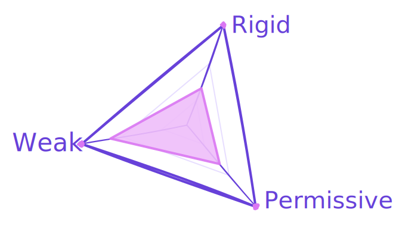

Every codebase has a set of rules. Whether implicit or explicit, these rules shape how software is written and how PRs are reviewed, and they allow multiple developers from different backgrounds to contribute to the same codebase. From placing a new file to naming a method, these rules standardise decisions so they don't feel like decisions anymore and become a collective intuition that makes every contributor speak a shared language they can all understand.

This article will give those rules a name. Because once you can name them, you can shape them.

## The Status Quo

The Status Quo is Latin for _the existing state of affairs_, but don't let that simple definition deceive you.

The Status Quo hides behind normality. It embeds itself so deeply in habit that it stopped looking like a choice and started looking like _the way things are_. It is not a believe you hold, it's a default you don't notice holding. The awareness of it only comes when something breaks the pattern: a different culture, a different era. Normality, as it turns out, is a matter of perspective.

Consider something as mundane as working days. Working five days a week is so embedded in everyday life that nobody questions a Monday-to-Friday schedule, but deviating from it requires explanation. The two-day weekend is not even [100 years old depending on your country](https://en.wikipedia.org/wiki/Workweek_and_weekend).

The Status Quo has two properties worth identifying before we move on.

### It reduces friction
The Status Quo removes deliberation. When behavior becomes automatic, you don't weigh options, you simply act. That saves effort not because the choice doesn't matter, but because it stopped feeling like a choice at all.
And because the Status Quo is widely adopted, this effect scales: it functions as a shared language, an implicit agreement that doesn't need to be stated. When everyone operates from the same defaults, there's no need to negotiate the basics. Take queueing: no one explains the rules, no one has to justify their place. That mutual understanding is what prevents constant micro-conflicts.

### It resists change
Challenging the Status Quo means proposing something unfamiliar. We might not love the current state of affairs, but we understand it. An alternative, however promising, introduces uncertainty: _will it actually be better?_ And even if it will, changing the Status Quo requires effort. Not just from one person, but from everyone involved. It demands coordination, iteration, and the collective will to push through discomfort. Once the change takes hold, it becomes the new Status Quo, effortless again, until someone challenges it once more.

These properties, friction reduction and resistance to change, are not good or bad. They are mechanics. They also reveal themselves in codebases.

## Status `Quode`

> The Status Quo in Code.

Software development is collaborative by nature, and most of that collaboration is asynchronous. Multiple people from different backgrounds, educations, and preferences contribute to a single shared codebase. Each developer authors only a tiny fraction of the total, so being able to read, navigate, and predict the shape of everyone else's work is essential.

An agreed programming language is not enough. Where to place files, how to name classes, group routes, indentation: all of these micro-agreements form a layer of shared understanding that sits on top of the technology itself. **This is what I call the Status Quode**.

Every codebase you have ever worked on has one. It is a combination of the industry's conventions for that specific language or framework, the team's accumulated preferences, the patterns the earliest contributors chose, and the corrections that happened along the way through PR reviews, team meetings, and tooling. It evolved. It was not designed. And most of the time, it is hard to articulate **what it is**, but easy to feel **when it is not**.

Just like its namesake, the Status Quode is largely unconscious. You don't think "I follow convention X when naming services". You just name the service they way you see fit. The pattern lives in routine and common sense, not in a document. You become aware of it only when someone breaks it, or when you join a new codebase that is not aligned with your own practices.

### Conventions vs the Status Quode

Conventions are conscious. They are discussed, agreed upon, written down. A convention is a statement of intent: this is how we want things to be done. But a convention can exist on paper and be dead in practice: documented in a wiki nobody reads, enforced in an optional linter that nobody runs.

The Status Quode is not what you agreed to do, it is **what you actually do**. It is the pattern that lives in every contributor's head that shapes code that the rest will then approve. Conventions attempt to shape the Status Quode, and when they succeed, the two align. But when they don't, the Status Quode is the accurate representation of reality: it is the practice, not the policy.

## Working with it

Just like the Status Quo, the Status Quode also reduces friction and it resists change. In a codebase, both of these show up in very concrete ways.

### Reading code gets faster
When the Status Quode is strong, you can predict where things are. You can guess the controller name from the route path. You can skip the parts you already know how to read and focus only on the parts that are new. Every deviation from the expected pattern signals something worth paying attention to, something deliberate, something that needs careful reading. The Status Quode makes the familiar invisible so the unfamiliar stands out.

### Writing code gets faster
Writing Status Quode code is closer to muscle memory than to decision-making. Decisions take time and energy. When the patterns are clear, you don't have to decide how to structure a new endpoint or where to put a helper function. You already know. It is the difference between adding yet another CRUD resource versus implementing a brand new protocol.

### PRs become frictionless
If you follow the Status Quode, your code is what your team expects. Not an outlier but exactly what any other developer would have written in your position. Reviewers spend their time on the logic, not on the shape.

But just like the status quo, the Status Quode also has a side that might work against you.

## Common Status Quode issues

Not all Status Quode are equal, and like any set of norms, they can be healthy or dysfunctional. The difference often lies in its presence and how consciously it is maintained.

### Too Weak
A weak Status Quode is one with no shared conventions. Maybe they barely exist and each developer follows their own style. Maybe they exist but in multiple conflicting versions, traces of different eras layered on top of each other without a canonical structure. Whether nothing is agreed or everything is permitted, the problem is the same: developers can't predict the shape of each other's code, and reading someone else's work means learning a new set of assumptions every time.

_What to do:_ pick one. Start from industry conventions for your language and framework, document them, enforce them. If two equivalent options exist and neither is objectively better, let the team vote. The goal is convergence, not perfection.

### Too Rigid
A rigid Status Quode leaves no room for alternatives. Every problem must be solved the established way, even when a different approach would be a better fit. If the Status Quode says everything is a REST endpoint, you won't even consider RPC. Solutions that don't match the mold face resistance, not because they are bad, but because they are different.

_What to do:_ create a transparent process to challenge it: RFCs, guild meetings. Make it clear that the Status Quode is meant to be questioned, just not during an inconvenient moment like a PR review.

### Too Permissive
A permissive Status Quode says "yes" too easily. Too many valid options coexist without clear criteria for choosing between them, and new ones keep getting added. Without friction, supported patterns only accumulate, they never shrink. For example, when a team canonically supports multiple languages, frameworks, and databases, developers tend to pick their favourite rather than the best tool for the job.

_What to do:_ document each decision branch explicitly. If you pick a different database for a specific case, the reasoning must be clear enough that another developer facing the same choice would reach the same conclusion. And require developers to try existing options first: the process to challenge the Status Quode from the previous point doubles as the gatekeeper here.

## Spotting and shaping yours

> The most important step is to recognise that your codebase has a Status Quode, and that it is worth examining.

### Spotting it
You already know your Status Quode. You _feel_ it every time you review a PR and something looks "off", even when the solution works. You feel it when you place a new file and you just _know_ where it goes. You feel it when a new team member's contribution is correct but doesn't match how "we do things here".

That feeling is the Status Quode asserting itself. The invitation is to stop and ask: _what rule is being enforced right now? Is it documented anywhere? Does it still serve us?_

Look at PR reviews where opinions diverge. Look at the patterns that no one decided but somehow everyone follows. That is your Status Quode (or lack of).

### Shaping it
Once you can see it, you can shape it.

If you want to propose something different, start by providing evidence.
- Prove that the current approach does not work. Recurring bugs due to misunderstandings, onboarding confusion, repeated friction in PR reviews.
- Prove that your proposal could work. Blog posts, similar projects that took that different approach, metrics from an experiment you ran. The Status Quode resists change like any Status Quo, so the burden of proof is on the challenger.

Choose the right place. Guild meetings, proposals, RFCs. Avoid challenging the Status Quode during PR reviews: that's where it gets enforced, not where it gets redesigned. It would slow down the process of shipping software and turns code reviews into philosophical debates.

Once the proposal is agreed upon, invest in enforcement: CI checks, linting rules, agentic skills/rules, auto-completions. Make the new way the path of least resistance. Because the moment it becomes effortless, it becomes the new Status Quode. This is where conventions earn their weight: not when they are written, but when they close the gap between what is documented and what is practiced.

## Your turn

The Status Quode is not a problem to solve. It is already happening in every codebase, shaped by everyone who ever contributed to it.

By calling it a name, we can look at it. By looking at it, we can talk about it. And it is only by talking about it that we can shape the Status Quode we have into the one we want.
