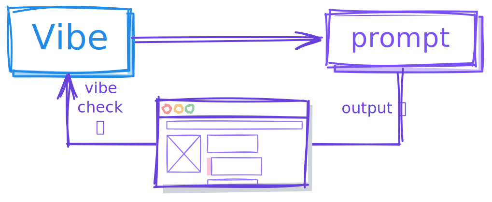
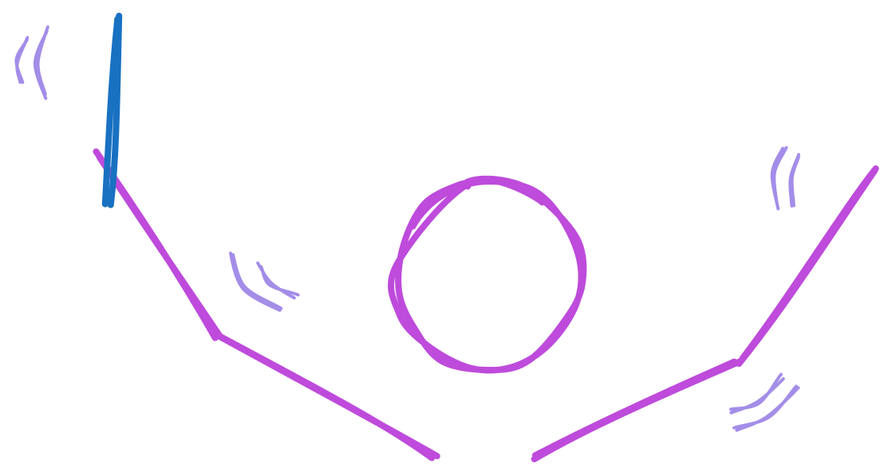
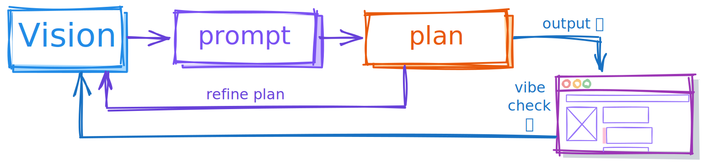

---
title: "Directed by juampi92"
date: "2026-04-23"
description: "Exploring the shift from manual coding to 'directing' AI: how intentionality and vision define the future of software craftsmanship."
thumbnail_image: "./conductor.svg"
--- 

Lately, I've been looking for a way to credit my software in a way that matches today's reality. Before LLMs, everything I wrote was either of my own creation, bootstrapped or copied from stack overflow (uncredited), or imported as a package (credited).

It didn't take long for the phrase ["vibe coding"](https://xcancel.com/karpathy/status/1886192184808149383) to catch up. The term describes the process of "giving in to the vibes", where you forget the code even exists and trust the LLM output entirely. In that process, most of the software decisions are taken by the agent without your awareness. You surrender the complexity entirely, to the point where you avoid it as much as possible.

Naturally, `vibed by juampi92` came to mind, but there's a misalignment between how I interpret vibe coding and what I'm actually doing while making software nowadays. I use agentic AI to produce code but the process goes **beyond the vibes**.

I will admit I review very little of what the AI produces, so the key difference with the vibes lies somewhere else. The better analogy is *directing*.

A film director does not act. An orchestra conductor does not play the violin. They don't just coordinate individual performers; they steer the collective effort toward a singular, cohesive outcome. The director holds the vision of what success looks like even before the process starts, and is capable of providing feedback and direction to their team to achieve it.

The key difference between vibing and directing is the level of freedom placed on the agents. I know what I want, and I know how I want it. I will plan the architecture, consider non-functional requirements, think of gaps on the plan, weigh tradeoffs, make compromises. I don't surrender the solution to the agent, I don't give in to the vibes, but I don't code it either.

A director must be able to justify every software decision without necessarily knowing or understanding the exact lines that were produced. It resembles how a tech lead works with a team of engineers. You review what comes back, often superficially, and trust that it serves the direction you set.

What you cannot delegate is the vision.