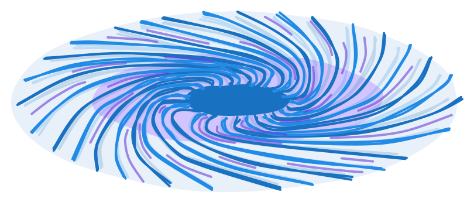
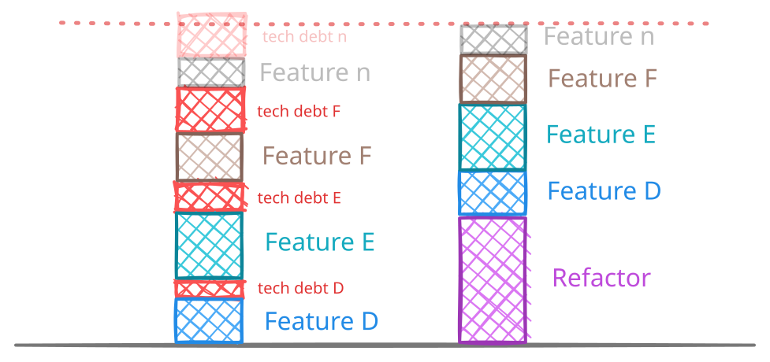

If you have worked with Domain Driven Design, you probably heard about the concept of a '[God Domain](https://medium.com/navalia/the-most-common-domain-driven-design-mistake-6c3f90e0ec2b)'. It usually happens when we identify a core concept of the business, and we don't make the active decision on separating it into smaller concepts. That is how we end up with "Product" rather than "Inventory", "Marketplace", "Delivery".

In most agile companies though, software gets produced before having the entire picture of the process, and the future is defined as we go. We can start with a lean product, and with time add a robust marketplace, incorporate a delivery mechanism, etc.

These domains develop a gravitational pull that attract vaguely-related functionality under tight development timelines, creating what I call **Vortex Domains**.

## The pull

In most agile software, change is done in small increments. Before a whole feature is defined, we expose the MVP to the world and validate it by measuring adoption. Because these changes start small, we tend to simplify their implementation, and this is where vortex domains start their pull.

These changes, on their own, don't feel big enough to deserve their own domain, their own database table, their own endpoint. So the question is never "how do we best describe this new problem?", but instead "what do I name this new column?". And the natural answer is the table that is already closest.

## The damage

This trap is dangerous because once the table `users` has a couple of settings columns (`is_sidebar_hidden`, `accepted_cookies`), the migration to `preferences` can be seen as expensive and starts to get postponed in the name of delivery. Over time, it becomes a hot area for merge conflicts, and a single point of failure. 

Eventually, this problem will be hard to ignore and the cost of refactoring will outweighs the cost of ignoring it. As we all know, that moment always comes too late.

Not every domain has this pull. A domain qualifies as vortex when it has this attraction to small product changes, so they are usually at the core parts of the business.

## Mitigation

Organizations don't usually have many vortex domains. The first step is simply to name them, **identify them**. I recommend looking at domains that are the center of most product features, connecting multiple domains.
Once discovered, the conversation around them changes.

Now, changes can be done consciously. If you find yourself adding another column to a vortex table, a new method to a vortex service/repository, or an extra property on a vortex endpoint response, think about the implications. How will this addition trap you?

### "A user can only have one primary project"

sounds like a user property, but it is not. The user does not have an attribute that is "their primary project"; the set of projects has one of them that is primary *for that user*.
Make sure your changes describe your domain, not a reference to another one.

> I call this "**Reverse reference**"

### UserSettings or Preferences?

There is a subtle difference between `UserSettings`, `UserActivity`, `UserPermissions` where they are framed as "a user *has* X", and `Preferences`, `AuditLogs`, `AccessPolicies` where they are their own concept.
My advice is to avoid naming possessions (user "has" settings) when naming concepts, and instead use references (setting's user reference). It helps shift the perspective.

> I call this "**References over possessions**"

### A new table for just one field?

There is a moment when your conceptual definition of a "User" is challenged. You are tasked with adding new preference to hide the sidebar, and even though you know this preference describes something else, the concept of a "UI Setting" is barely an infant in your organization. Without knowing if more preferences will follow, or if this is just one outlier, you are tempted to follow the path of least resistance, and avoid giving birth to a new concept.

This patch works fine until a new UI Setting comes your way. This time you must either reconsider the previous dilemma or you move forward with the **conceptual marriage** of User & UI Setting.

In a company, it is likely that the developer who made the first decision is not the same one making the second. Consequently, this conceptual marriage often happens without anyone being explicitly aware of it. To fix this, talk to product and propose the UI Setting concept outside of technical language. Birthing this new concept will justify it being separate, guaranteeing new features will fall in the right place.

> I call this "**Concept divorce**"

## A disclaimer

Not every accumulation is bad. Some domains legitimately have many attributes, and that is fine. The point of this post is not to make you paranoid about every column you add. It is to help you identify which domains in your system are the ones that pull, so you can pay close attention when working around them.

Name your vortex domains. Pay close attention to the moments where the pull happens. Most of the win comes from turning unconscious decisions into conscious ones.